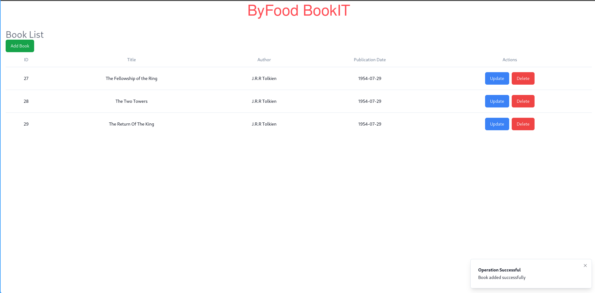
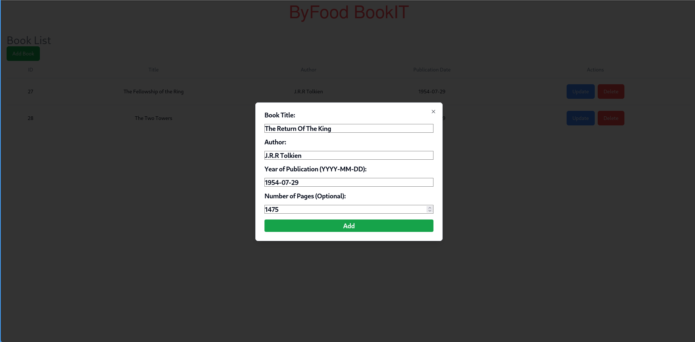
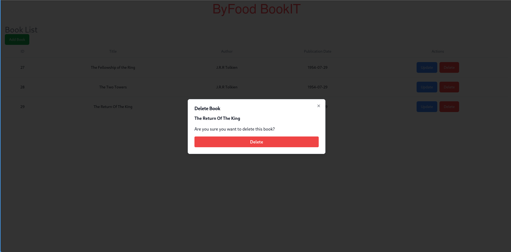
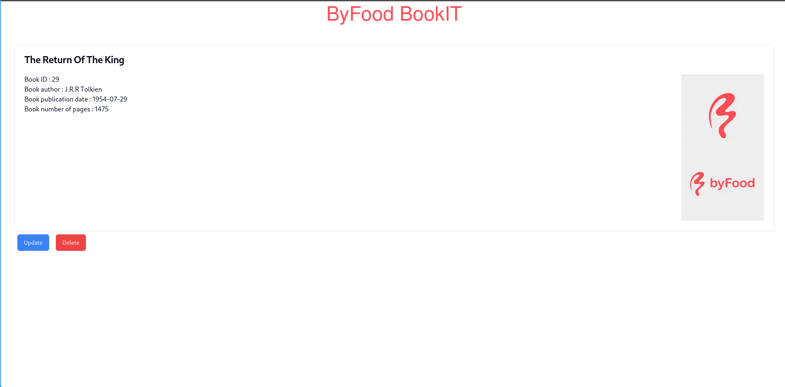

## NextJS Frontend for the Book Library Assignment

## Setup
After cloning the repository, cd into the repository directory/front and run `npm install` to fetch missing dependencies

## Running
Run using the development server with `npm run dev` or build locally with `npm run build` and serve as a production preview with `npm run start`

##Screenshots

